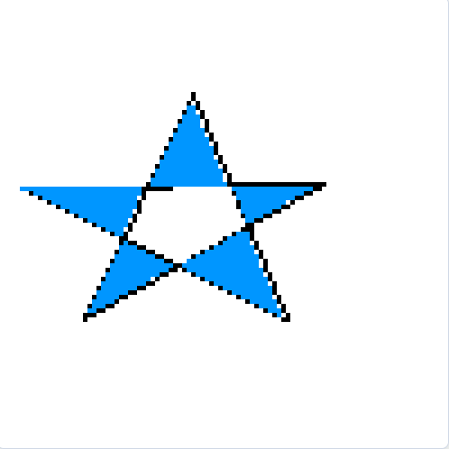
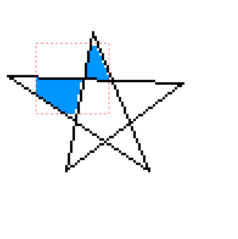
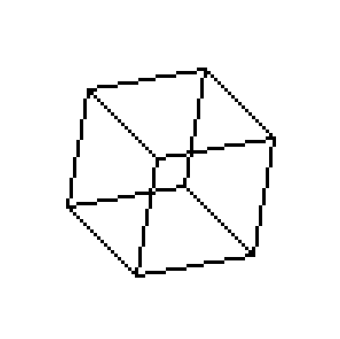

# Mini Paint - Trabalho Prático de Computação Gráfica

Este projeto é uma aplicação web desenvolvida como trabalho prático para a disciplina de Computação Gráfica. Trata-se de um editor gráfico simples, um "Mini Paint", que implementa do zero diversos algoritmos clássicos de rasterização, preenchimento, recorte, transformações 2D e projeção 3D.

A interface permite selecionar diferentes ferramentas para desenhar e manipular formas em um canvas digital baseado em uma grade de pixels.

## Funcionalidades Implementadas

O projeto inclui a implementação dos seguintes algoritmos:

-   **Rasterização de Primitivas:**
    -   Reta de **Bresenham**
    -   **Círculo** de Ponto Médio
-   **Curvas:**
    -   Curva de **Bézier Cúbica**
-   **Preenchimento de Polígonos:**
    -   **Flood Fill** (4-vizinhos, implementado com pilha)
    -   **Scanline**
-   **Recorte (Clipping):**
    -   Recorte de Linha com **Cohen-Sutherland**
-   **Transformações Geométricas 2D:**
    -   **Translação**, **Escala** e **Rotação** aplicadas a polígonos, implementadas com matrizes e coordenadas homogêneas.
-   **Projeções 3D:**
    -   **Projeção Ortográfica** de um cubo 3D aramado, com rotação interativa em tempo real nos eixos X, Y e Z.

## Demonstração

Aqui estão alguns exemplos de cada funcionalidade em ação.

**Figura 1:** Polígono complexo preenchido com o algoritmo Scanline.

**Figura 2:** Reta sendo recortada por uma janela de recorte retangular.

**Figura 3:** Projeção ortográfica de um cubo 3D após ser rotacionado.

## Como Executar

Este projeto não requer instalação de dependências, apenas um navegador web moderno.

1.  Clone ou baixe este repositório.
2.  Abra o arquivo `index.html` no seu navegador de preferência (Google Chrome, Firefox, etc.).
3.  Utilize a interface para selecionar as ferramentas e desenhar no canvas.

## Estrutura do Projeto

O código está organizado da seguinte forma:

-   `computacao-grafica/` (Pasta Raiz)
    -   `index.html`
    -   `README.md`
    -   `images/`
        -   `Cubo3D`
        -   `Recorte_Linha`
        -   `Scanline`
    -   `js/` (Pasta de Scripts)
        -   `main.js`
        -   `bresenham.js`
        -   `circulo.js`
        -   `curva.js`
        -   `preenchimento.js`
        -   `scanline.js`
        -   `recorte.js`
        -   `transformacoes.js`
        -   `projecoes.js`